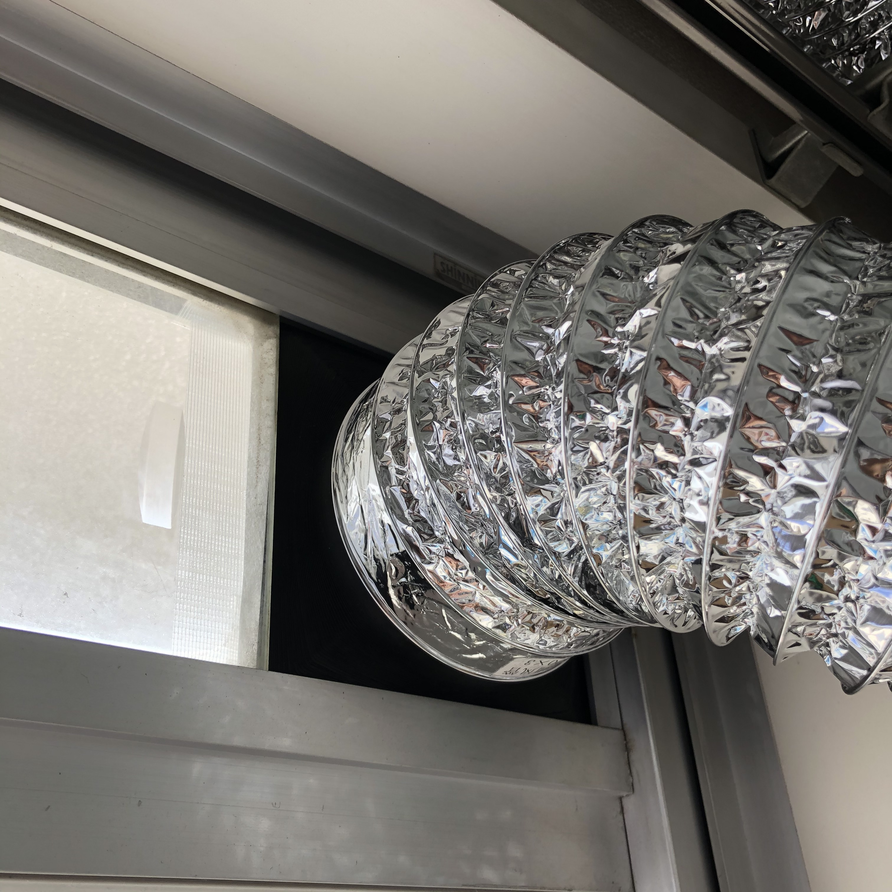
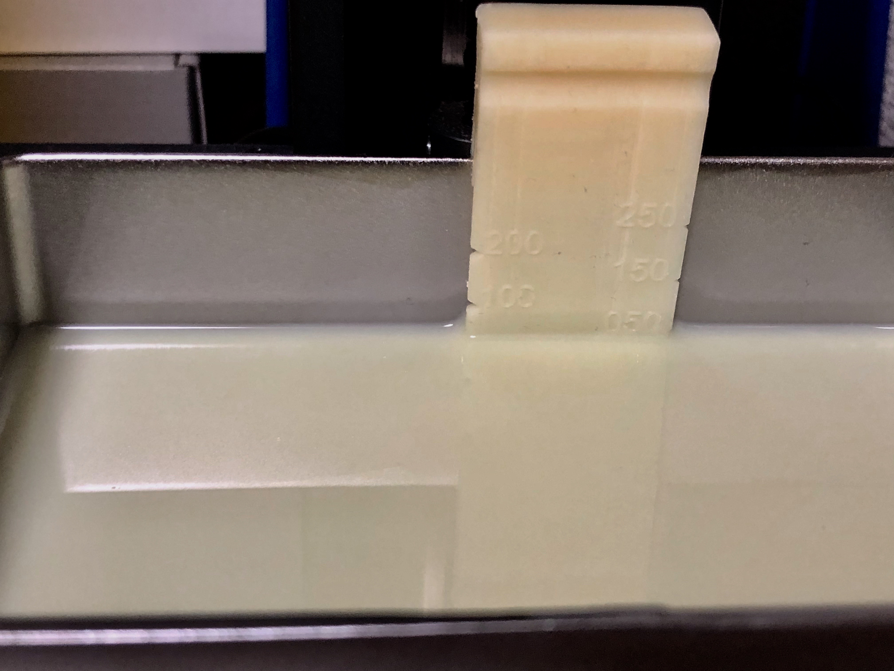
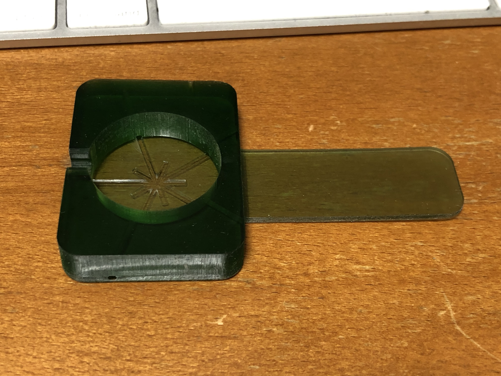
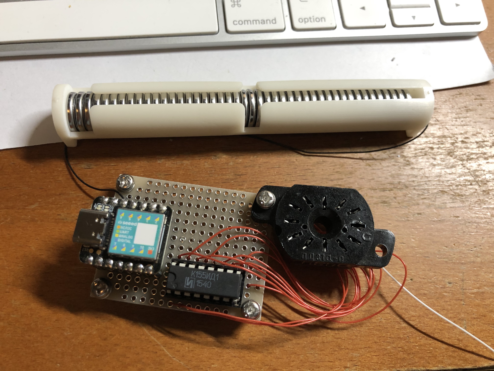

# 3D-Datas

オリジナルの3Dプリント用のデータです。
my original 3d works by fusion360.

翻訳はDeepl.com使ってます。オレより英語上手いんだもん。

## 小窓用排気ダクトアダプタ

100mmφのアルミフレキシブルダクトをアルミサッシの小窓に取り付けるためのアダプタです。各社規格が違うので周辺の四角い部分サイズを調整してください。
内側にマキタの掃除機用HEPAフィルタ(https://amzn.to/357kcJy)を取り付けできるようになっていますので、ダクトを外した時でも外のホコリが入ってきません。

## レジン量の目盛り（resin gage for orange30）

バットの中にどのぐらいレジンが残っているかを表示する目盛りです。レジンが毛管現象で裏側に垂れないようスリットを追加しました。

This scale indicates how much regin is left in the bat. A slit was added to prevent the regin from sagging on the back side by capillary phenomenon.

## AppleWatch充電器の台（apple_watch_charger_stand）

AppleWatchの充電器、ケーブルに引っ張られてあっちにフラフラ、AppleWatchに吸い付いてこっちにフラフラ、するのを防ぎます。

It secures the AppleWatch's charger nicely. No more dizzying your charger getting pulled by cables or AppleWatch!

## CR1225直列ケース（Case-lots-of-CR1225）

ボタン電池CR1225を45本直列にするための電池ボックスです。ニキシー管点灯させました。

This is a battery box to put 45 CR1225 batteries in series. The Nixie tube is lit.

動画：https://twitter.com/TareObjects/status/1241164378549800961

## SLA 3Dプリンタしずく落とし

出力後にはビルドプレートにレジンがたくさん残っていてもったいない。手で持っていると疲れるし落とす可能性があるので、治具を作ってみました。こんなのでもver 6、立体が斜めに組み合わさっているやつの設計むずかしいっす。STLの他にFusion360データも置いておくので、見た目はお好きなようにいじってください。

It would be a waste to have so many regins left in the build plate after output. I made a jig because holding it by hand is tiring and there is a possibility of dropping it, so I made a jig. I'm not sure how to design ver 6, which has a diagonal shape, but I'll put Fusion360 data in addition to STL.

## ATmega328PのPin揃えるやつ

Twitterで見かけた自作「ピン揃ったー」を真似してみました。簡単なものなのに、いい感じのバネにするのに5回試作してやっと出来上がりました。

I tried to imitate the homemade "Pin Alignment" that I saw on Twitter. It took me 5 prototypes to get a good spring for something so simple.

## Parts-Case

表面実装部品を入れるケースです。六角形なのでびっしり詰め込めます。

This is a case for surface mount device（SMD）. Because it is hexagonal, you can fill it to the brim.

| Resin | Printer | Recipe |
---|---|---
| Nylon like photopolymer | Longer3D Orange30 | Longer3D Nylon Like Resion 50um |

## Card Holder

SLAプリンタのバットにトランプを立てておく台です。地味です。でも吹いたり洗ったりする手間が省けます。

This is a stand on which to place playing cards on the bat of the SLA printer. It is grounded. But it saves you the trouble of blowing and washing.

## TWELITE Pal Case

TWELITE Palがぴったり収まるケースです。レジンによって収縮率が違うので、これはLonger 3D Standard Gray Resin用のデータです。

This case fits the TWELITE Pal perfectly. This is the data for Longer 3D Standard Gray Resin, since the shrinkage rate is different for each resin.
