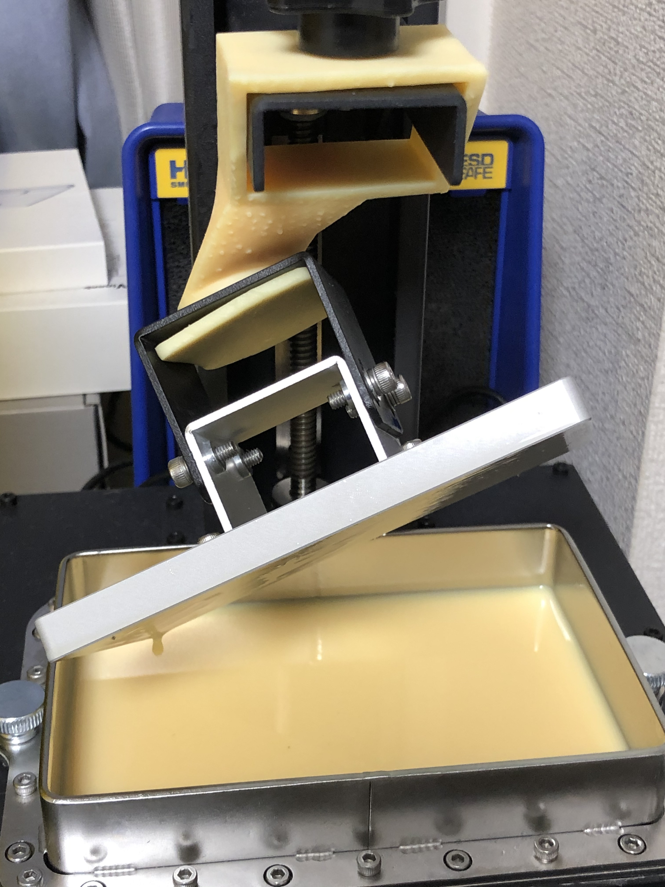
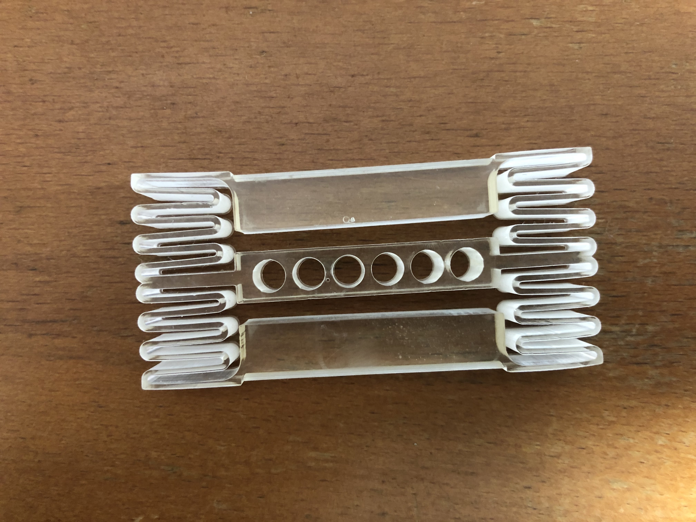

# 3D-Datas

オリジナルの3Dプリント用のデータです。
my original 3d works by fusion360.

## CR1225直列ケース

ボタン電池CR1225を45本直列にするための電池ボックスです。ニキシー管点灯させました。

## SLA 3Dプリンタしずく落とし

出力後にはビルドプレートにレジンがたくさん残っていてもったいない。手で持っていると疲れるし落とす可能性があるので、治具を作ってみました。こんなのでもver 6、立体が斜めに組み合わさっているやつの設計むずかしいっす。STLの他にFusion360データも置いておくので、見た目はお好きなようにいじってください。

This is a jig that waits for resin to drip from the building-plate on your behalf.

## ATmega328PのPin揃えるやつ

Twitterで見かけた自作「ピン揃ったー」を真似してみました。簡単なものなのに、いい感じのバネにするのに5回試作してやっと出来上がりました。

## Parts-Case

表面実装部品を入れるケースです。六角形なのでびっしり詰め込めます。
Case for SMD parts. 

| Resin | Printer | Recipe |
---|---|---
| Nylon like photopolymer | Longer3D Orange30 | Longer3D Nylon Like Resion 50um |

## Card Holder

SLAプリンタのバットにトランプを立てておく台です。地味です。でも吹いたり洗ったりする手間が省けます。

## TWELITE Pal Case

TWELITE Palがぴったり収まるケースです。レジンによって収縮率が違うので、これはLonger 3D Standard Gray Resin用のデータです。
