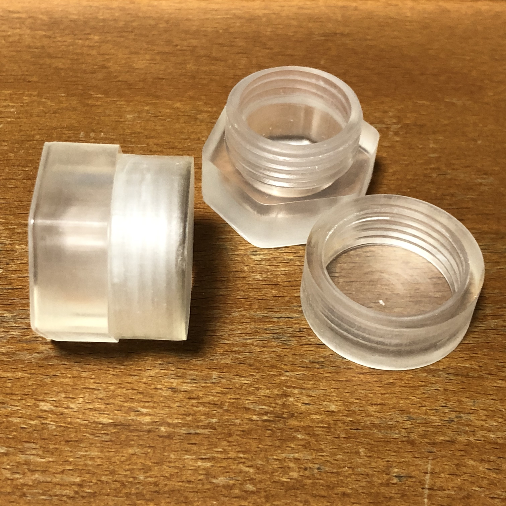

# 3D-Datas

オリジナルの3Dプリント用のデータです。
my original 3d works by fusion360.

## ATmega328PのPin揃えるやつ

Twitterで見かけた自作「ピン揃ったー」を真似してみました。簡単なものなのに、いい感じのバネにするのに5回試作してやっと出来上がりました。

## Parts-Case

表面実装部品を入れるケースです。六角形なのでびっしり詰め込めます。
Case for SMD parts. 

| Resin | Printer | Recipe |
---|---|---
| Nylon like photopolymer | Longer3D Orange30 | Longer3D Nylon Like Resion 50um |

## Card Holder

SLAプリンタのバットにトランプを立てておく台です。地味です。でも吹いたり洗ったりする手間が省けます。

## TWELITE Pal Case

TWELITE Palがぴったり収まるケースです。レジンによって収縮率が違うので、これはLonger 3D Standard Gray Resin用のデータです。
